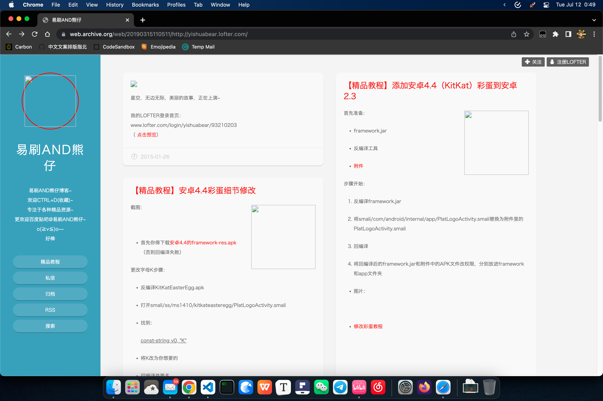
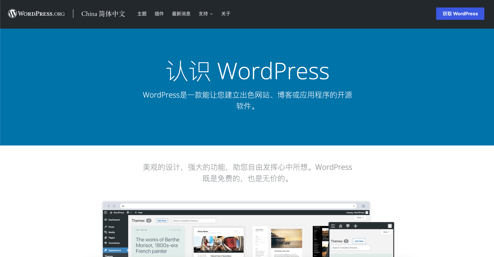
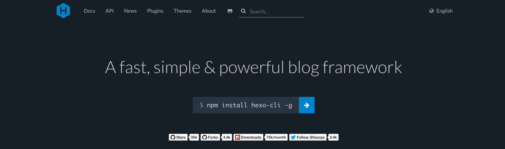
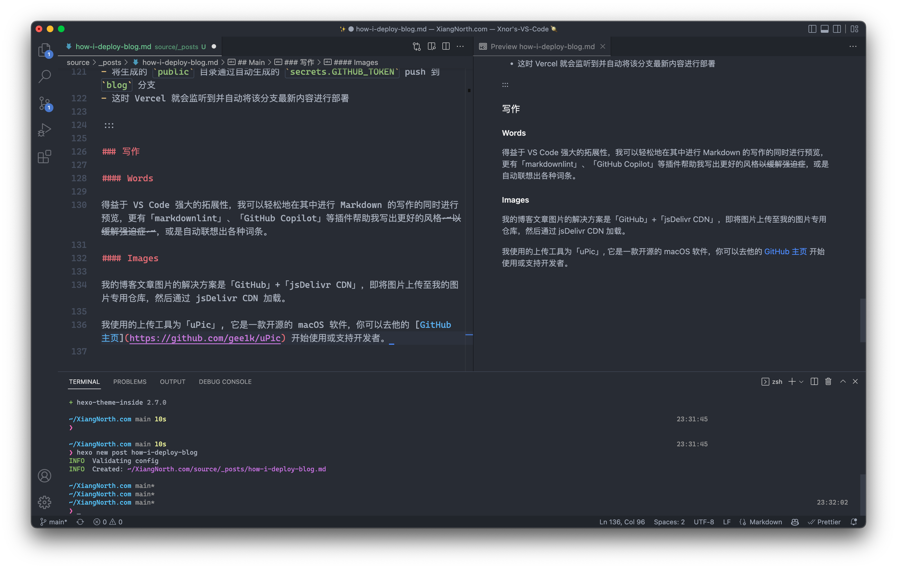
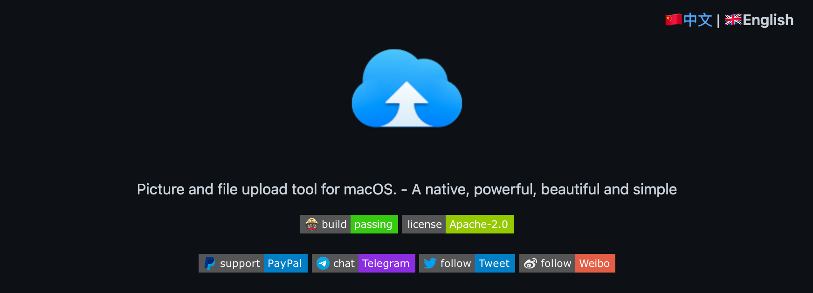
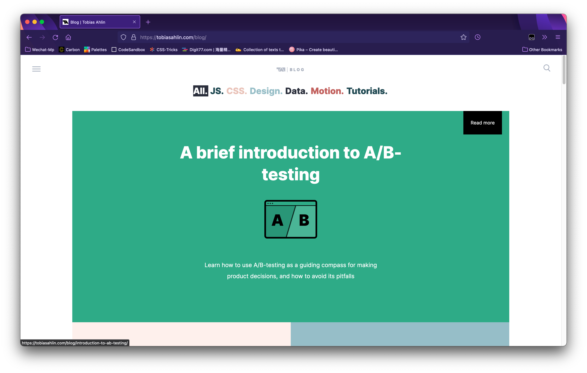
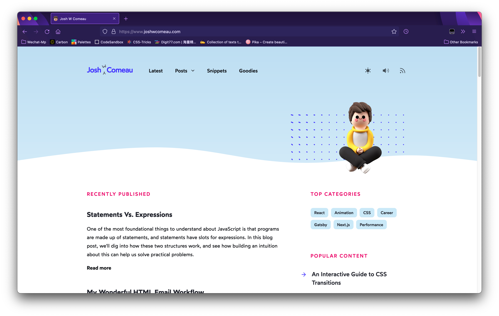

---
tags:
  - post
  - '🧑‍💻Coding'
title: 我是如何开始发表博客的
sources:
  - xlog
summary: |-
  Prologue Lofter

  在 2014 年，我在 Lofter 开始了一段时间的博客写作生活，也成为了上面的首批用户。

  有幸被 Wayback Manchine 收录了一张快照。

  那时刚接触 Android，也就是我人生的第一台属于自己的安卓手机——「中兴 U793…
attributes:
  - value: how-i-publish-blog
    trait_type: xlog_slug
external_urls:
  - https://i.xiangnorth.com/how-i-publish-blog
date_published: 2019-03-03T23:48:00.000Z
---

# 我是如何开始发表博客的

## Prologue

### Lofter

在 2014 年，我在 [Lofter](https://lofter.com/) 开始了一段时间的博客写作生活，也成为了上面的首批用户。



有幸被 [Wayback Manchine](https://web.archive.org/web/20190315110511/http://yishuabear.lofter.com/) 收录了一张快照。

那时刚接触 Android，也就是我人生的**第一台属于自己的安卓手机**——「中兴 U793」。在研究刷机，学习 ROM 制作的时候，我发现了 [XDA Developers](https://xda-developers.com/)。

于是出于兴趣开始陆续搬运上面的相关文章。

### WordPress



大名鼎鼎的 [WordPress](https://wordpress.com/)，是我**第一个**个人网站的框架。

一句题外话，依稀记得当初 WordPress 中文官网被墙，英文官网能访问的魔幻现实。

由于当时经济能力限制，我曾辗转 [Hostinger](https://www.hostinger.com/)，[000webhost](https://www.000webhost.com/)，以及国内各种杂七杂八的免费空间（什么「彩虹云」、「七朵云」、「千云」等等），当然这也直接导致了我众多密码的泄露，导致现在社工库里能有一连串密码

我也同时从 [freenom](https://freenom.com/) 注册了~~不止~~一个免费域名。途中注册的波折也是我接触到「科学上网」的起源，至今仍记得当时凌晨在网吧，死活加载不出 CAPTCHA 的痛苦。

在网站搭建中，我也开始接触到 `PHP` `CSS` `MySQL`等事物，也是被当时 [DIYgod](https://github.com/DIYgod) 的 WordPress 主题 Amativeness 所吸引，让我逐渐在后续的时间开始了学习，这些在[「名为『Hexo-Theme-Anya』的故事」](/the-story-of-anya)一文中有详细描述，此处不作赘述。

### Hexo



最后归宿来到了 [Hexo](https://hexo.io/)，是一个非常「简单」的博客框架。

接触到 Hexo 是因为接触到了 GitHub，与 WordPress 作为动态网站，需要一系列后端支撑不同，静态网站能够不用花费那么多心思就能将博客稳定搭建到 GitHub Pages，Vercel 等静态站点托管平台甚至是静态资源加速 CDN 上，让我轻松了不少。

**本篇文章写作时**，博客便是搭建在在 Hexo 上。

## Main

我的博客是一个静态网站，**没有动态，没有 API，没有管理后台，没有任何的动态更新**，只有一个静态页面。

她由 Hexo 驱动，样式由 [Inside](https://github.com/ikeq/hexo-theme-inside) 提供，部署于 [Vercel](https://vercel.com/) 平台，部分静态文件由 [jsDelivr](https://www.jsdelivr.com/) 提供 CDN 加速。

### CI/CD

> 在软件工程中，CI/CD 或 CICD 通常指的是持续集成和持续交付或持续部署的组合实践。CI/CD 通过在应用程序的构建、测试和部署中实施自动化，在开发和运营团队之间架起了桥梁。

在这里，主要是介绍 [GitHub Actions](https://github.com/features/actions) 在部署我的博客中的使用，**不会**涉及 Hexo 怎么配置，怎么上传到。

```yaml
name: Blog CI/CD

on: [push, repository_dispatch]

jobs:
blog-cicd:
name: Hexo blog build & deploy
runs-on: ubuntu-latest
env:
TZ: Asia/Shanghai
steps: - name: Checkout codes
uses: actions/checkout@v2

      - name: Setup node
        uses: actions/setup-node@v1
        with:
          node-version: "16.x"
      - name: Cache node modules
        uses: actions/cache@v1
        with:
          path: ~/.npm
          key: ${{ runner.os }}`-node-${{ hashFiles('**/package-lock.json') }}

      - name: Install dependencies
        run: |
          npm install hexo-cli -g
          npm install
      - name: Generate files
        run: hexo generate

      - name: Deploy blog
        run: |
          git clone -b blog "https://${{ secrets.GH_REF }}" deploy_git
          mv ./deploy_git/.git ./public/
          cd ./public
          git config user.name "XiangNorth"
          git config user.email "i@xiangnorth.com"
          git add .
          git commit -m "GitHub Actions Auto Builder at $(date +'%Y-%m-%d %H:%M:%S')"
          git push --force --quiet "https://XiangNorth:${{ secrets.GITHUB_TOKEN }}@${{ secrets.GH_REF }}" blog:blog
```

为了方便并「优雅」地部署，我使用了 `secrets.GITHUB_TOKEN` 来代替 GitHub 的 API Token，你可以在 [这篇文档](https://docs.github.com/en/actions/security-guides/automatic-token-authentication) 了解更多。

原理是就是简单的，当「push」，或者手动触发——即「dispatch」——时，就会触发这个 CI/CD 进程：

- 检查并配置环境
- 运行 `hexo generate`
- 将生成的 `public` 目录通过自动生成的 `secrets.GITHUB_TOKEN` push 到 `blog` 分支
- 这时 Vercel 就会监听到并自动将该分支最新内容进行部署

### Editing

### Words



得益于 VS Code 强大的拓展性，我可以轻松地在其中进行 Markdown 的写作的同时进行预览。

更有「markdownlint」、「GitHub Copilot」等插件帮助我写出更好的风格~~以缓解强迫症~~，或是自动联想出各种词条。

### Images

我的博客文章图片的解决方案是「GitHub」+「jsDelivr CDN」，即将图片上传至我的图片专用仓库，然后通过 jsDelivr CDN 加载。



我使用的上传工具为「uPic」, 它是一款开源的 macOS 软件，你可以去他的 [GitHub 主页](https://github.com/gee1k/uPic) 开始使用或支持开发者。

### Inspiration

如何获取写作灵感，我使用了两种方式：

- 通过不断经历获得感悟（学习、生活、工作）
- 通过阅读更多的**原创文章**，吸收其中的能量

关于阅读原创文章，我更多是通过 RSS 订阅[「中文独立博客列表」](https://github.com/timqian/chinese-independent-blogs)进行充能，如果您有兴趣也可以参考一份，也欢迎订阅 [本站的 RSS](https://xiangnorth.com/atom.xml)。

也欢迎大家在这个被各种算法推荐流充斥的时代，尝试 RSS 这个稍显「落后」的阅读方式。

## Epilogue

最近正在学习 React，重构博客的想法也随着再次冒了出来。

在平时的阅读中也见过很多大佬或漂亮或优雅的页面，如[「Tobias Ahlin」](https://tobiasahlin.com/blog/)和[「Josh W Comeau」](https://www.joshwcomeau.com/)。





总之岁月静好，还有很多时间，我们慢慢来。
